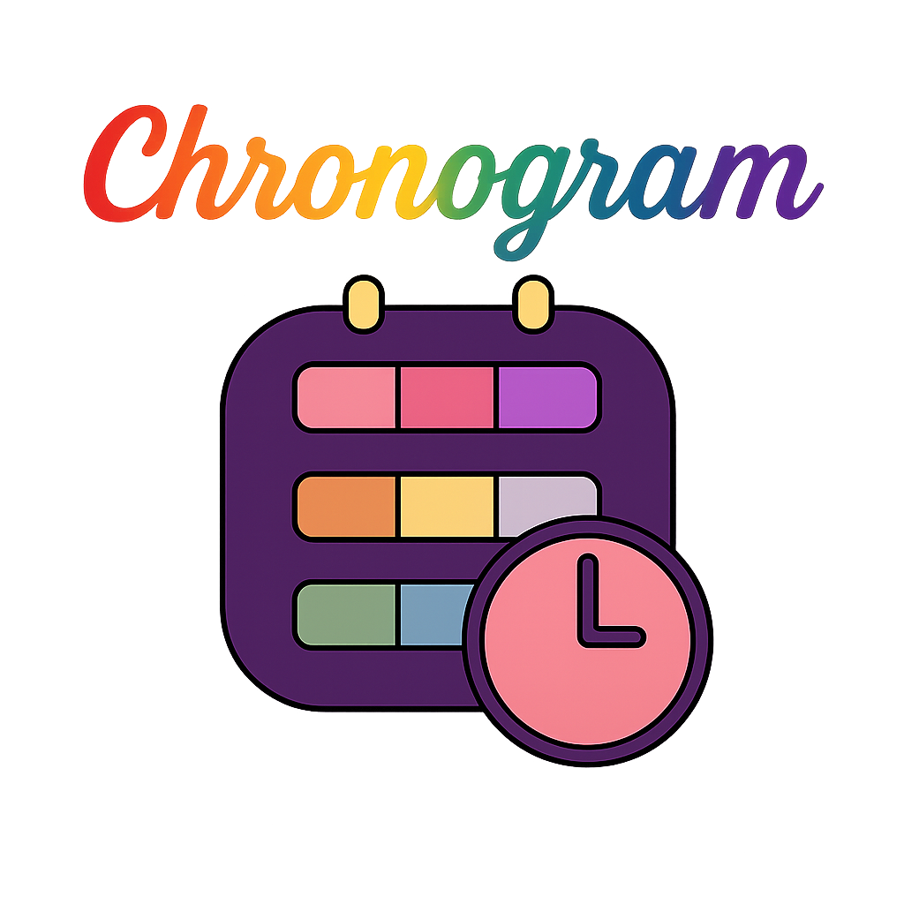

<p align="center">
  
</p>


<p align="center" style="margin-top: 40px;">
             <!-- Rosso -->
     <!-- Arancione -->
      <!-- Giallo -->
         <!-- Verde -->
                              <!-- Azzurro -->
                                   <!-- Blu -->
                                       <!-- Viola -->
</p>


## 💼 License

All rights reserved.
This code is proprietary and intended for academic or personal reference only.
Unauthorized use, modification, or redistribution is prohibited.

[📊 View Chronogram Presentation](https://docs.google.com/presentation/d/14NgOd5NSt-bIzUknydG7A0ilcgBkQL68LGOZmH8EEhI/edit?slide=id.g35803e53045_1_16)

The goal of this project is to develop an Android application that allows users to record their daily activities. The app will feature a main page for real-time activity tracking, logging the various activities performed throughout the day. On the same page, the user will also be able to view activity logs from the previous two days. The design supports both real-time and retrospective logging, enabling users to choose the frequency of notifications based on their daily routines. This flexibility makes the app suitable for both personal use and for researchers or organizations conducting time-use studies.

---

## 🚀 Features

* Secure user registration and login
* Password hashing
* MySQL database integration
* Client-server communication
* Basic frontend form validation
* Protection against common vulnerabilities (e.g., SQL injection, password theft)


---

## 🛠️ Tech Stack

| Layer    | Technology              |
| -------- | ----------------------- |
| Backend  | MySQL + Struts 2 + Apache Tomcat (v9.0.71) + Nginx + Ngrok(to expose https endpoint)       |
| Frontend | HTML, SCSS, TypeScript, Vue, Ionic, Capacitor(Andorid)   |


---
<details>
<summary>🔐 <strong>Environment Variables (.env)</strong></summary>

> [!IMPORTANT]
> ⚠️ **Make sure all `.env` files are saved with LF (Unix-style) line endings — especially after each edit.**  
> On Windows, you can switch from `CRLF` to `LF` in the bottom-right corner of editors like VS Code.  
> This prevents parsing issues in Docker, Node, and other tools.


The project uses two environment configuration files that look like these:


### 1. Root `.env` (Backend Configuration)
Located in the project root folder:

```env
# Database
MYSQL_ROOT_PASSWORD=your_root_password
MYSQL_DATABASE=chronogram
MYSQL_USER=chronouser
MYSQL_PASSWORD=your_db_password
# API Keys
LLM_API_KEY=your_openrouter_api_key
# Email
MAIL_HOST=smtp.gmail.com
MAIL_PORT=587
MAIL_USER=your_email@gmail.com
MAIL_PASSWORD=your_app_password
# Security
JWT_SECRET_KEY=your_jwt_secret_key
APP_CANONICAL_URL=http://localhost:8100
```

### 2. Front `.env` (Frontend Configuration)

Located in /frontend folder

```env
VITE_API_BASE_URL=https://your-ngrok-subdomain.ngrok-free.app/chronogram
```
</details>

---
<details>
<summary>🖥️ <strong>Platform Requirements</strong></summary>

To ensure smooth setup and compatibility, the project is intended to be run as follows:

- **Frontend (Ionic)**: Developed and tested on **Windows**  
  You should run the Ionic CLI (`ionic serve`) and perform all frontend development in a **Windows environment**.

- **Backend (Docker, MySQL, Tomcat, ngrok, setup scripts)**: Run on **Linux** or a **Linux virtual machine**  
  All backend services — including Docker containers (MySQL, Tomcat), ngrok, and setup scripts like `setup_fresh_backend.sh` and `refresh_tomcat_server.sh` — must be executed in a **native Linux environment** or **Linux virtual machine** for proper compatibility and reliability.

> [!Important]
> The backend **has not been tested on WSL2** (Windows Subsystem for Linux). Its compatibility is currently unknown, so it is **not recommended** to use WSL2 for backend development.

</details>

---

<details>
<summary>⚙️ <strong>Setting Up a Development Environment</strong></summary>

0. **Install Backend Environment (on Windows)**

   These are required globally on your Linux system before launching the app in the forntend in Windows.

   ````bash
	# --- Java 11+ ---
	sudo apt update
	sudo apt install openjdk-11-jdk

	# Verify Java version
	java -version

	# --- Maven ---
	sudo apt install maven

	# Verify Maven version
	mvn -v

	# --- Node.js (v18.x recommended) ---
	# Use Node Version Manager (nvm) to install/manage Node versions
	curl -o- [https://raw.githubusercontent.com/nvm-sh/nvm/v0.39.3/install.sh](https://raw.githubusercontent.com/nvm-sh/nvm/v0.39.3/install.sh) | bash
	source ~/.bashrc
	nvm install 18
	nvm use 18

	# Verify Node.js and npm
	node -v
	npm -v

	# --- Docker + Docker Compose ---
	docker -v
	docker compose version

   ````

1. **Install Frontend Environment (on Windows)**

   This section sets up the frontend development environment on **Windows**, including Node.js via `fnm` (Fast Node Manager) and the Ionic CLI.

   > ⚠️ The frontend must be developed on **Windows**, and Node.js should be installed using `fnm`, as recommended by the official Node.js documentation for Windows.

   ````powershell
   # --- Install fnm (Fast Node Manager) ---
   # Open PowerShell or Windows Terminal and run:
   iwr -useb https://fnm.vercel.app/install | iex

   # After installation, restart the terminal or run:
   refreshenv

   # --- Install Node.js (v18.x recommended) ---
   fnm install 18
   fnm use 18
   fnm default 18

   # Verify Node.js and npm
   node -v
   npm -v

   # --- Install Ionic CLI globally ---
   npm install -g @ionic/cli

   # Verify Ionic version
   ionic -v


2. **Clone the repository into a shared folder (Linux VM <-> Windows)**

   To ensure seamless collaboration between the **frontend (Windows)** and **backend (Linux VM)**, it's recommended to clone the repository into a **shared folder** that both systems can access (e.g., VMWare shared folder or a mounted network drive).

   This allows the Windows-hosted frontend and the Linux-hosted backend to work with the same source code base.

   ```bash
   # From inside your Linux virtual machine:
   cd /path/to/shared/folder
   git clone https://github.com/bonoboprog/Chronogram.git
   cd Chronogram
   ```

2. **Install ngrok on Linux and start a tunnel**

   Install ngrok via Apt with the following command:


   ```bash
	curl -sSL https://ngrok-agent.s3.amazonaws.com/ngrok.asc \
  	  | sudo tee /etc/apt/trusted.gpg.d/ngrok.asc >/dev/null \
  	  && echo "deb https://ngrok-agent.s3.amazonaws.com buster main" \
  	  | sudo tee /etc/apt/sources.list.d/ngrok.list \
          && sudo apt update \
          && sudo apt install ngrok
   ```

   Add your authtoken (If you don’t have an authtoken then [Sign up](https://dashboard.ngrok.com/signup) for a free account).

   ```bash
   ngrok config add-authtoken <YOUR_NGROK_AUTHTOKEN>
   ```
   
   Start an endpoint:

   ```bash
   ngrok http 80
   ```

4. **Start backend environment on Linux**

   ```bash
   ./setup_fresh_backend.sh
   ```

    This script will:

    - Stop and remove old containers
    - Build the backend (`build.sh`)
    - Start MySQL and Tomcat
    - Initialize the database with `schema.sql`

5. **Refresh backend after making code changes**

   ```bash
   ./refresh_tomcat_server.sh
   ```

6. **Set up the LLM with your API key 🔑**

   1. Go to [https://openrouter.ai](https://openrouter.ai)
   2. Click **Sign In** in the top-right corner and log in (you can use GitHub, Google, etc.)
   3. Go to the [API Keys Dashboard](https://openrouter.ai/keys)
   4. Click **"Create new key"**
   5. Copy your newly generated key
   6. Paste it into your `.env` file as follows:

      ```env
      LLM_API_KEY=your_openrouter_key_here
      ```

7. **Launch the app frontend in Windows**

   Open a terminal window — preferably the **integrated terminal** of your favorite IDE — and navigate to the `frontend/` folder located in the project root. Then run:

   ```bash
   ionic build
   ionic serve
   ```
   


8. **Connect to MySQL container from Windows (e.g., using MySQL Workbench)**

   If you want to inspect or manage the backend MySQL database from **Windows**, you can connect to the running MySQL container using tools like **MySQL Workbench**.

   The MySQL container exposes the **default MySQL port 3306** to the host, making it accessible from Windows as long as the Docker host is reachable (e.g., if running on a local Linux VM with bridged or host networking).

   #### ✅ Steps:

   1. Open **MySQL Workbench** on Windows.
   2. Create a **new connection** with the following settings:
      - **Hostname**: IP address or hostname of the Linux VM (e.g., `192.168.x.x`)
      - **Port**: `3306`
      - **Username**: use the `MYSQL_USER` defined in the backend `.env` file
      - **Password**: use the corresponding `MYSQL_PASSWORD` (check "Store in Vault…" if desired)
   3. Test the connection and save.

   > 💡 You can find the database name in the `.env` file under `MYSQL_DATABASE`.

   > ⚠️ Make sure the container is up and that the port `3306` is properly published in `docker-compose.yml`, e.g.:
   > ```yaml
   > ports:
   >   - "3306:3306"
   > ```

   > 🔐 Ensure no firewall or network rule is blocking the connection between Windows and the Linux host.
</details>

---

<details> 
<summary>🗃️ <strong>Explore the Database</strong></summary>


 1. **Access via terminal:**

    ```bash
    docker exec -it chronogram-mysql mysql -u chronouser -pchronopass chronogram
    ```

 2. **Verify the tables:**

    ```bash
    SHOW TABLES;
    DESCRIBE nome_tabella;
    ```

</details>

---

<details>
<summary>📦 <strong>Database Schema Management</strong></summary>

1. **After making EER/Workbench changes → forward engineer into MySQL container**

2. **Export the schema**

   ```bash
   ./export_schema.sh
   ```

3. **Version the schema**

   ```bash
   git add docker/init/schema.sql
   git commit -m "🔄 DB structure updated"
   git push
   ```

> \[!IMPORTANT]
> ⚠️ The `setup_fresh_backend.sh` script automatically loads `schema.sql` only on the first startup (empty volume).
>
> To force a reset:
>
> ```bash
> docker compose down -v
> ./setup_fresh_backend.sh
> ```
</details>

---

<details>
<summary>🤝 <strong>Contributing</strong></summary>

Each contributor can:

```bash
git clone ...
./dev_setup.sh
```

Then contribute to:

* Backend (Java)
* Frontend (/mobile)
* Schema DB (`export_schema.sh`)

> \[!NOTE]
> 🧠 Note: The `schema.sql` file is the single source of truth for the database!
</details>

---

## 👥 Contributors

| Name             | GitHub                                         |
| ---------------- | ---------------------------------------------- |
| Violeta Perez    | [@violetapd](https://github.com/violetapd)     |
| Paolo Simeone    | [@bonoboprog](https://github.com/bonoboprog)   |
| Giuseppe Alfieri | [@giusalfieri](https://github.com/giusalfieri) |

